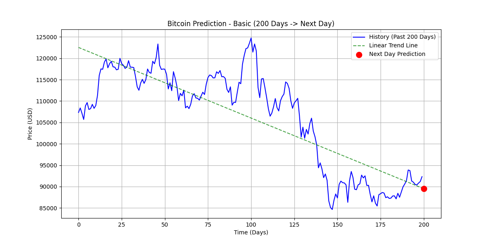
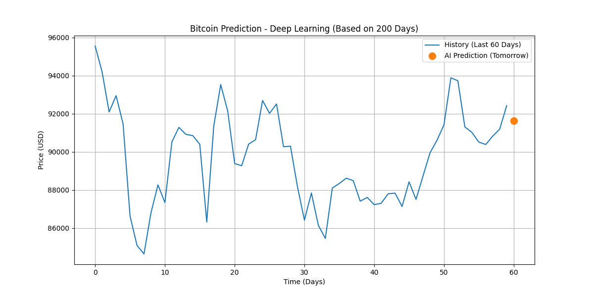

# 📈 Bitcoin 예측 앱 사용 가이드

> `bitcoin_basic.py`와 `bitcoin_deep.py` 알고리즘이 HTML에 어떻게 반영되었는지 설명

---

## 📁 파일 구조

| 파일 | 역할 |
|------|------|
| `bitcoin_basic.py` | **선형 회귀(Linear Regression)** 기반 추세 예측 |
| `bitcoin_deep.py` | **딥러닝(MLP)** 기반 패턴 예측 |
| `bitcoin_*_result.png` | Python 스크립트가 생성하는 예측 차트 이미지 |
| `index.html` | 예측 결과를 시각적으로 보여주는 웹 대시보드 |

---

# 🔵 bitcoin_basic.py (선형 회귀 모델)

## Step 1️⃣ 데이터 수집

```python
df = yf.download('BTC-USD', interval='1d', period='1y', progress=False)
data = df.tail(200).copy()  # 최근 200일 데이터
```

- **yfinance** 라이브러리로 Yahoo Finance에서 비트코인 일봉 데이터 수집
- 최근 **200일** 데이터를 분석 대상으로 사용

---

## Step 2️⃣ 데이터 전처리

```python
X = np.arange(len(prices)).reshape(-1, 1)  # 시간: 0, 1, 2, ..., 199
y = prices.reshape(-1, 1)                   # 가격: $45000, $46000, ...
```

- 날짜를 **수치형 시퀀스(0~199)**로 변환
- 머신러닝 모델이 이해할 수 있는 형태로 변환

---

## Step 3️⃣ 모델 학습 - 선형 회귀

```python
from sklearn.linear_model import LinearRegression

model = LinearRegression()
model.fit(X, y)  # y = wx + b 형태의 추세선 학습
```

**알고리즘 설명:**
- **선형 회귀(Linear Regression)**: 데이터의 전체적인 상승/하락 방향을 **하나의 직선**으로 표현
- 수식: `가격 = 기울기(w) × 날짜 + 절편(b)`
- **장점**: 단순하고 해석이 쉬움, 전체적인 추세 파악에 유리
- **단점**: 급격한 변동이나 비선형 패턴을 포착하지 못함

---

## Step 4️⃣ 미래 예측

```python
X_future = np.array([[len(prices)]])  # 201번째 날
predicted_price = model.predict(X_future)[0][0]
```

- 학습된 추세선을 **연장**하여 다음 날 가격 예측
- 200일간의 평균적인 상승/하락 추세를 그대로 적용

---

## Step 5️⃣ 시각화

```python
plt.plot(X, model.predict(X), label='Linear Trend Line')  # 추세선
plt.scatter([len(prices)], [predicted_price])              # 예측점
plt.savefig('bitcoin_basic_result.png')                    # 이미지 저장
```

### 생성되는 차트:
- 🔵 **파란선**: 과거 200일 실제 가격
- 🟢 **녹색 점선**: 선형 추세선
- 🔴 **빨간점**: 다음 날 예측 가격

---

# 🔴 bitcoin_deep.py (딥러닝 모델)

## Step 1️⃣ 데이터 수집 + 피처 엔지니어링

```python
df = yf.download('BTC-USD', interval='1d', period='2y', progress=False)

# 추가 피처: 이동평균선
df['MA5'] = df['Close'].rolling(window=5).mean()   # 5일 단기 추세
df['MA20'] = df['Close'].rolling(window=20).mean() # 20일 중기 추세

features = ['Close', 'Volume', 'MA5', 'MA20']  # 4개의 입력 변수
```

**Basic과의 차이:**
- 2년치 데이터 사용 (더 많은 학습 데이터)
- **다변량(Multivariate)** 입력: 종가뿐만 아니라 거래량, 이동평균선도 함께 고려

---

## Step 2️⃣ 데이터 정규화

```python
from sklearn.preprocessing import MinMaxScaler

scaler = MinMaxScaler()
scaled_data = scaler.fit_transform(data[features])
```

**왜 정규화가 필요한가?**
- 가격: `$40,000 ~ $100,000`
- 거래량: `1,000,000 ~ 100,000,000,000`
- 스케일이 다르면 모델이 특정 피처에 편향됨
- **0~1 사이로 정규화**하여 모든 피처의 영향력을 균등하게 함

---

## Step 3️⃣ 슬라이딩 윈도우 데이터셋

```python
window_size = 10  # 과거 10일을 보고 다음 날 예측

for i in range(len(scaled_data) - window_size):
    X.append(scaled_data[i : i + window_size])     # 1~10일 데이터
    y.append(scaled_data[i + window_size, 0])      # 11일째 종가
```

**슬라이딩 윈도우 방식:**
```
[1~10일 데이터] → 11일 가격 예측
[2~11일 데이터] → 12일 가격 예측
[3~12일 데이터] → 13일 가격 예측
...
```

- 시계열 데이터의 **패턴**을 학습
- "과거 10일의 흐름이 이랬을 때, 다음 날은 이렇게 됐다"를 학습

---

## Step 4️⃣ 딥러닝 모델 설계 (MLP)

```python
from tensorflow.keras.models import Sequential
from tensorflow.keras.layers import Dense, Dropout

model = Sequential([
    Dense(64, activation='relu', input_shape=(40,)),  # 10일 × 4피처 = 40
    Dropout(0.2),    # 과적합 방지
    Dense(32, activation='relu'),
    Dense(16, activation='relu'),
    Dense(1)         # 출력: 다음 날 가격
])
```

**모델 구조 (MLP - Multi-Layer Perceptron):**

```
입력층 (40개 뉴런)
   │
   ▼
은닉층 1 (64개 뉴런) + ReLU + Dropout(20%)
   │
   ▼
은닉층 2 (32개 뉴런) + ReLU
   │
   ▼
은닉층 3 (16개 뉴런) + ReLU
   │
   ▼
출력층 (1개 뉴런 - 예측 가격)
```

**구성 요소 설명:**
| 레이어 | 역할 |
|--------|------|
| `Dense(64, relu)` | 40개 입력을 64개 특징으로 확장, 비선형 패턴 학습 |
| `Dropout(0.2)` | 뉴런 20%를 무작위로 비활성화 → **과적합 방지** |
| `Dense(32, 16)` | 점진적으로 특징 압축 |
| `Dense(1)` | 최종 가격 1개 출력 |

---

## Step 5️⃣ 모델 학습

```python
model.compile(optimizer='adam', loss='mse')
model.fit(X_flat, y, epochs=100, batch_size=8, verbose=0)
```

| 파라미터 | 값 | 설명 |
|----------|-----|------|
| optimizer | Adam | 학습률 자동 조절 최적화 알고리즘 |
| loss | MSE | 평균 제곱 오차 (예측값과 실제값 차이) |
| epochs | 100 | 전체 데이터를 100번 반복 학습 |
| batch_size | 8 | 8개 샘플씩 묶어서 가중치 업데이트 |

---

## Step 6️⃣ 미래 예측

```python
last_window = scaled_data[-window_size:]  # 가장 최근 10일
input_vector = last_window.reshape(1, -1)
pred_scaled = model.predict(input_vector)

# 0~1 → 실제 달러 가격으로 역변환
predicted_price = target_scaler.inverse_transform(pred_scaled)[0][0]
```

- 마지막 10일치 패턴을 입력
- 학습된 패턴 매칭으로 내일 가격 예측
- 정규화 역변환으로 실제 달러 가격 복원

---

## Step 7️⃣ 시각화

```python
display_days = 60  # 최근 60일만 표시 (가독성)
plt.plot(dates_idx, past_prices, label='History')
plt.scatter([len(past_prices)], [predicted_price], label='AI Prediction')
plt.savefig('bitcoin_deep_result.png')
```

### 생성되는 차트:
- 🔵 **파란선**: 최근 60일 실제 가격
- 🟠 **주황점**: AI가 예측한 내일 가격

---

# 🌐 HTML 웹 대시보드 (index.html)

## Python과 HTML의 관계

```
┌─────────────────────┐     ┌─────────────────────┐
│  bitcoin_basic.py   │     │  bitcoin_deep.py    │
│                     │     │                     │
│  python script 실행  │     │  python script 실행  │
│         │           │     │         │           │
│         ▼           │     │         ▼           │
│  bitcoin_basic_     │     │  bitcoin_deep_      │
│  result.png 생성    │     │  result.png 생성    │
└─────────────────────┘     └─────────────────────┘
          │                           │
          ▼                           ▼
┌──────────────────────────────────────────────────┐
│                   index.html                     │
│                                                  │
│  ┌────────────────┐   ┌────────────────┐        │
│  │  Basic 카드    │   │   Deep 카드    │        │
│  │                │   │                │        │
│  │    │   │  "deep.png">   │        │
│  └────────────────┘   └────────────────┘        │
└──────────────────────────────────────────────────┘
```

## HTML 구조 분석

```html
<!-- Basic 모델 카드 -->
<div class="card">
    <div class="card-title">
        단순 추세 예측
        <span class="badge badge-basic">Basic</span>
    </div>
    <p class="description">
        지난 200일간의 가격 흐름을 한 줄의 직선으로 평균 내어,
        상승/하락의 큰 방향성을 보여줍니다.
    </p>
    
</div>
```

```html
<!-- Deep 모델 카드 -->
<div class="card">
    <div class="card-title">
        AI 패턴 분석
        <span class="badge badge-deep">Deep</span>
    </div>
    <p class="description">
        200일 데이터 중 최근 10일간의 가격 변동 패턴과
        유사한 흐름을 찾아 내일의 가격을 예측합니다.
    </p>
    
</div>
```

**HTML은 Python이 생성한 PNG 이미지를 `` 태그로 삽입하여 표시**

---

# 🆕 Python에 없는 HTML 전용 요소

## 1. 사용자 친화적 설명

| Python 출력 | HTML 표시 |
|-------------|-----------|
| `Linear Regression` | "단순 추세 예측" + 설명 문구 |
| `Deep Learning Model` | "AI 패턴 분석" + 설명 문구 |

HTML은 비전문가도 이해할 수 있도록 **한글 설명** 추가

## 2. Toss 스타일 UI

```css
:root {
    --background: #f2f4f6;
    --card-shadow: 0 4px 16px rgba(0, 0, 0, 0.04);
}

.card {
    background-color: var(--white);
    border-radius: 20px;
    box-shadow: var(--card-shadow);
}
```

- 토스(Toss) 앱 스타일의 **카드 기반 UI**
- 둥근 모서리, 그림자 효과
- 모바일 친화적 반응형 디자인

## 3. 뱃지 시스템

```html
<span class="badge badge-basic">Basic</span>  <!-- 파란색 -->
<span class="badge badge-deep">Deep</span>    <!-- 빨간색 -->
```

모델 유형을 색상으로 시각적 구분

## 4. 면책 조항

```html
<div class="footer">
    투자의 책임은 본인에게 있습니다. 재미로만 봐주세요!
</div>
```

---

# 📊 Basic vs Deep 모델 비교

| 항목 | Basic (선형 회귀) | Deep (딥러닝 MLP) |
|------|-------------------|-------------------|
| **알고리즘** | Linear Regression | Multi-Layer Perceptron |
| **입력 데이터** | 종가만 | 종가 + 거래량 + MA5 + MA20 |
| **데이터 기간** | 1년 | 2년 |
| **분석 방식** | 전체 추세 직선 | 10일 패턴 매칭 |
| **예측 특성** | 장기 방향성 | 단기 변동 패턴 |
| **복잡도** | 낮음 | 높음 |
| **해석 가능성** | 높음 | 낮음 (블랙박스) |
| **과적합 위험** | 낮음 | 있음 (Dropout으로 완화) |

---

# 🚀 사용 방법

## 1. 예측 실행

```bash
cd /Users/hong/main/현주/자기관리/bitcoin

# 가상환경 활성화
source venv/bin/activate

# Basic 모델 실행
python bitcoin_basic.py

# Deep 모델 실행
python bitcoin_deep.py
```

## 2. 결과 확인

```bash
# 터미널에서 결과 확인
[Basic Model Prediction]
Current Price (Day 200): $97500.00
Predicted Price (Next Day): $98200.00
Expected Change: +700.00 (+0.72%)

[Advanced Model Prediction]
Current Price:   $97500.00
Tomorrow Pred:   $96800.00
Expected Change: -700.00 (-0.72%)
```

## 3. 웹 대시보드 확인

```bash
# 브라우저에서 열기
open index.html
```

---

# ⚠️ 주의사항

1. **투자 조언이 아닙니다** - 학습/연구 목적으로만 사용
2. **과거 패턴 ≠ 미래 예측** - 시장은 예측 불가능한 요소가 많음
3. **모델 한계**:
   - Basic: 급등락, 횡보장에서 부정확
   - Deep: 학습 데이터에 과적합될 수 있음
4. **실시간 아님** - 스크립트 실행 시점의 데이터 기준

---

*이 문서는 `bitcoin_basic.py`, `bitcoin_deep.py`, `index.html`의 코드 분석을 기반으로 작성되었습니다.*
