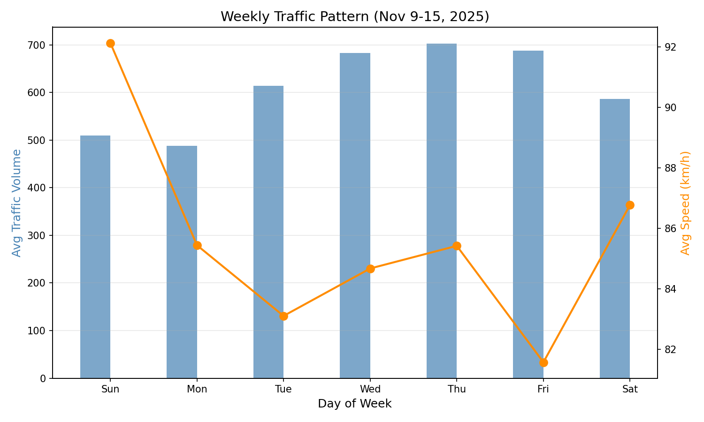
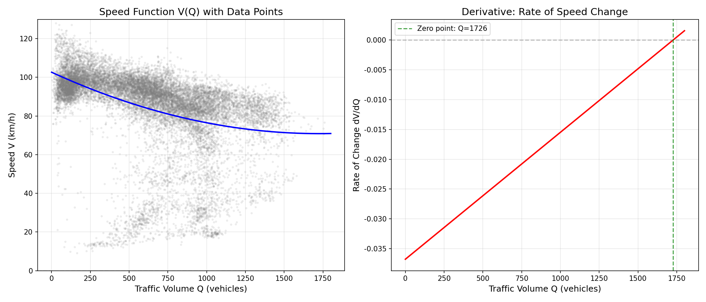

# 🚗 Traffic 교통 혼잡 분석 사용 가이드

> `01_data_loader.py`, `02_analysis.py` 알고리즘이 HTML에 어떻게 반영되었는지 설명

---

## 📁 파일 구조

| 파일 | 역할 |
|------|------|
| `src/01_data_loader.py` | VDS 원본 데이터 로드 및 전처리 |
| `src/02_analysis.py` | **Greenshields 모델** 분석 + 그래프 생성 |
| `index.html` | 기본 분석 결과 대시보드 |
| `lab.html` | **시뮬레이션 Lab** (BPR 함수 적용) |
| `js/simulation.js` | 시뮬레이션 로직 (JavaScript) |
| `*.png` | Python이 생성한 분석 차트 이미지 |

---

# 📥 01_data_loader.py (데이터 전처리)

## Step 1️⃣ 데이터 수집

```python
RAW_DATA_DIR = os.path.join(BASE_DIR, 'VDS_*')  # VDS 폴더
TARGET_NODES = ['안현JC', '일직JC', '조남JC', '도리JC']

df = pd.read_csv(file, encoding='euc-kr', sep=',', thousands=',')
```

- **VDS(Vehicle Detection System)**: 한국도로공사 차량검지시스템 데이터
- 4개 고속도로 분기점(JC) 대상: 안현, 일직, 조남, 도리
- 7일간 총 **17,090개** 데이터 포인트

---

## Step 2️⃣ 데이터 필터링

```python
# 분석 대상 JC만 필터링
df_filtered = merged_df[merged_df['노드명'].isin(TARGET_NODES)].copy()

# 이상치 제거 (측정 오류)
df_filtered = df_filtered[
    (df_filtered['교통량'] > 0) & 
    (df_filtered['평균속도'] > 0)
]
```

**필터링 조건:**
- ✅ 4개 JC만 포함
- ✅ 교통량 > 0 (0 이하는 측정 오류)
- ✅ 속도 > 0 (정지 상태 제외)

---

## Step 3️⃣ 파생 변수 생성

```python
# 밀도(Density) 계산
df_filtered['밀도'] = df_filtered['교통량'] / df_filtered['평균속도']
```

**밀도란?**
- 수식: `밀도 = 교통량(Q) ÷ 속도(V)`
- 의미: **1km 구간에 차가 몇 대 있는가** (단위: 대/km)
- 밀도가 높을수록 → 막힘

---

## Step 4️⃣ 출력

```python
df_filtered.to_csv(OUTPUT_PATH, index=False, encoding='utf-8-sig')
# 저장 위치: data/processed/jc_filtered_data.csv
```

---

# 📊 02_analysis.py (데이터 분석)

## Step 1️⃣ 기초 통계

```python
daily_stats = df.groupby('요일명')['평균속도'].mean().sort_values()

# 결과:
# 🐢 가장 느린 요일: 금요일 (81.6 km/h)
# 🐇 가장 빠른 요일: 일요일 (92.1 km/h)
```

---

## Step 2️⃣ Greenshields 모델 분석

### 이론적 배경

**Greenshields 모델**: 1935년 Bruce Greenshields가 제안한 교통류 이론

```
속도(v) = 자유속도(uf) × (1 - 밀도/혼잡밀도)
```

**핵심 개념:**
| 파라미터 | 의미 | 도출 방법 |
|----------|------|-----------|
| 자유속도 (uf) | 차가 없을 때 속도 | 회귀선의 y절편 |
| 혼잡밀도 (kj) | 속도가 0이 되는 밀도 | 회귀선의 x절편 |
| 도로용량 (C) | 최대 통행 가능량 | (uf × kj) / 4 |

### Python 구현

```python
# 선형 회귀: 속도 = a × 밀도 + b
z = np.polyfit(clean_df['밀도'], clean_df['평균속도'], 1)
slope, intercept = z

# 파라미터 추출
uf = intercept           # 자유속도 (y절편)
kj = -intercept / slope  # 혼잡밀도 (x절편)
q_max = (uf * kj) / 4    # 도로용량 (포물선 꼭짓점)
```

### 분석 결과

```
[🚦 Greenshields 모델 분석 결과]
1. 자유속도(uf): 103.7 km/h (차가 없을 때 예상 속도)
2. 혼잡밀도(kj): 50.2 대/km (이만큼 차면 멈춤)
3. 도로용량(C) : 1,301 대/시 (최대 통행 가능량)
```

---

## Step 3️⃣ 시각화

```python
# 1. 속도-밀도 산점도 + 추세선
plt.scatter(clean_df['밀도'], clean_df['평균속도'], alpha=0.1)
plt.plot(x_range, p(x_range), "r-", label='Greenshields Model')
plt.savefig('speed_density.png')

# 2. 요일별 교통량/속도 패턴
ax1.bar(week_order, daily_vol, label='교통량')
ax2.plot(week_order, daily_spd, label='속도')
plt.savefig('weekly_pattern.png')
```

### 생성되는 차트

| 파일명 | 내용 |
|--------|------|
| `speed_density.png` | 속도-밀도 산점도 + Greenshields 추세선 |
| `weekly_pattern.png` | 요일별 교통량(막대) + 속도(선) |
| `hourly_pattern.png` | 시간대별 패턴 |
| `traffic_speed_scatter.png` | 교통량-속도 산점도 |
| `derivative_analysis.png` | 미분(변화율) 분석 |

---

# 🌐 HTML 구현

## index.html (기본 대시보드)

### Python → HTML 반영

```
┌─────────────────────────┐
│  01_data_loader.py      │
│  ↓                      │
│  전처리된 CSV 생성      │
└─────────────────────────┘
          ↓
┌─────────────────────────┐
│  02_analysis.py         │
│  ↓                      │
│  PNG 차트 이미지 생성   │
│  - weekly_pattern.png   │
│  - hourly_pattern.png   │
│  - traffic_speed_*.png  │
│  - derivative_*.png     │
└─────────────────────────┘
          ↓
┌─────────────────────────┐
│  index.html             │
│        │
│  PNG 이미지 삽입        │
└─────────────────────────┘
```

### HTML 구조

```html
<!-- 요일별 패턴 -->
<div class="card">
    <h3>요일별 속도 비교</h3>
    
    <div class="alert alert-success">
        🥇 일요일 (92.1 km/h) - 가장 원활
    </div>
    <div class="alert alert-danger">
        🐢 금요일 (81.6 km/h) - 가장 막힘
    </div>
</div>

<!-- 수학적 모델링 -->
<div class="card">
    <div class="equation-box">
        Speed = a(Traffic)² + b(Traffic) + c
    </div>
    
</div>
```

---

## lab.html (시뮬레이션 Lab)

### Python 분석값 → JavaScript 적용

`02_analysis.py` 결과:
```python
uf = 103.7   # 자유속도
q_max = 1301 # 도로용량
```

`simulation.js` 적용:
```javascript
const PARAMS = {
    uf: 103.7,       // km/h (Python 분석값)
    capacity: 1301,  // vph (Python 분석값)
    alpha: 0.15,     // BPR 표준 계수
    beta: 4.0        // BPR 표준 지수
};
```

---

# 🆕 Python에 없는 HTML 전용 기능

## 1. BPR 통행시간 함수 (lab.html)

### 이론

**BPR(Bureau of Public Roads) 함수**: 미국 도로국에서 개발한 통행시간 계산 공식

```
T = T₀ × [1 + α × (Q/C)^β]
```

| 파라미터 | 의미 | 값 |
|----------|------|-----|
| T₀ | 자유통행시간 | 거리 ÷ 자유속도 |
| Q | 현재 교통량 | 사용자 입력 |
| C | 도로용량 | 1,301 (분석값) |
| α | 계수 | 0.15 (표준) |
| β | 지수 | 4.0 (표준) |

### JavaScript 구현

```javascript
function calculateTime(traffic, routeConfig) {
    const t0 = (routeConfig.distance / PARAMS.uf) * 60; // 분 단위
    const cap = PARAMS.capacity * routeConfig.capacity_scale;
    
    // BPR 공식
    const congestionFactor = 1 + PARAMS.alpha * Math.pow((traffic / cap), PARAMS.beta);
    return t0 * congestionFactor;
}
```

▶️ **Python에서는 분석만**, HTML에서 **실시간 시뮬레이션** 추가

---

## 2. 경로 배분 시뮬레이터

```javascript
const ROUTES = {
    A: { distance: 5.0, capacity_scale: 1.0 },  // 단거리
    B: { distance: 8.0, capacity_scale: 1.2 }   // 우회로 (용량 1.2배)
};
```

### UI 컨트롤

```html
<input type="range" id="totalDemand" min="1000" max="5000">  <!-- 총 교통량 -->
<input type="range" id="splitRatio" min="0" max="100">       <!-- 경로 분배 -->
```

**기능:**
- 총 교통량(1,000~5,000대) 조절
- A/B 경로 분배 비율 조절
- 실시간 소요시간 계산
- 균형 상태(Equilibrium) 자동 판별

---

## 3. 균형 상태 판별

```javascript
const diff = Math.abs(tA - tB);

if (diff < 1.0) {
    // ⚖️ 균형 상태 (Equilibrium)!
    eqMsg.className = 'alert alert-success';
} else if (tA < tB) {
    // ⚠️ 불균형: A가 더 빠름 → 운전자들이 A로 몰림
    eqMsg.className = 'alert alert-warning';
}
```

**User Equilibrium**: 두 경로 시간이 같아지는 상태
- 개인이 "나한테 가장 빠른 길"을 선택하면 자연스럽게 도달

---

## 4. MathJax 수식 렌더링

```html
<script src="https://cdn.jsdelivr.net/npm/mathjax@3/es5/tex-mml-chtml.js"></script>

<div class="equation-box">
    $$ v = u_f \left( 1 - \frac{k}{k_j} \right) $$
</div>
```

- LaTeX 문법으로 수학 공식 표시
- Greenshields 모델, BPR 함수 수식 시각화

---

## 5. Chart.js 인터랙티브 차트

```javascript
const simChart = new Chart(ctx, {
    type: 'bar',
    data: {
        labels: ['Route A (단거리)', 'Route B (우회로)'],
        datasets: [{
            label: '예상 소요시간 (분)',
            data: [tA, tB]
        }]
    }
});
```

- 슬라이더 조작 시 **실시간 차트 업데이트**
- Python의 정적 PNG 대비 **동적 인터랙션** 제공

---

# 📊 기능 비교 요약

| 기능 | Python | HTML |
|------|:------:|:----:|
| VDS 데이터 로드 | ✅ | ❌ |
| 데이터 전처리 | ✅ | ❌ |
| 밀도 계산 | ✅ | ❌ |
| Greenshields 모델 | ✅ | ⚠️ (파라미터만 표시) |
| 요일/시간대 패턴 | ✅ | ⚠️ (이미지로 표시) |
| 정적 차트 생성 | ✅ | ❌ |
| BPR 통행시간 함수 | ❌ | ✅ |
| 경로 배분 시뮬레이션 | ❌ | ✅ |
| User Equilibrium 판별 | ❌ | ✅ |
| 인터랙티브 슬라이더 | ❌ | ✅ |
| 수식 렌더링 (MathJax) | ❌ | ✅ |
| 스크롤 프로그레스 바 | ❌ | ✅ |

---

# 🚀 사용 방법

## 1. 데이터 전처리

```bash
cd /Users/hong/main/현주/자기관리/traffic
python src/01_data_loader.py
```

**출력:**
```
🚀 데이터 전처리를 시작합니다...
📄 발견된 데이터 파일 개수: 7개
✅ 전처리 완료!
💾 저장 위치: data/processed/jc_filtered_data.csv
📊 최종 데이터 개수: 17,090개
```

## 2. 분석 실행

```bash
python src/02_analysis.py
```

**출력:**
```
[1] 요일별 평균 속도 분석
🐢 가장 느린 요일: 금요일 (81.6 km/h)
🐇 가장 빠른 요일: 일요일 (92.1 km/h)

[🚦 Greenshields 모델 분석 결과]
1. 자유속도(uf): 103.7 km/h
2. 혼잡밀도(kj): 50.2 대/km
3. 도로용량(C) : 1,301 대/시

✅ 그래프 저장 완료: weekly_pattern.png
```

## 3. 웹 대시보드 확인

```bash
open index.html    # 기본 분석
open lab.html      # 시뮬레이션 Lab
```

---

# 📚 교통공학 이론 요약

| 이론 | 수식 | 적용 |
|------|------|------|
| **Greenshields 모델** | v = uf(1 - k/kj) | 속도-밀도 관계 분석 |
| **BPR 함수** | T = T₀[1 + α(Q/C)^β] | 통행시간 계산 |
| **User Equilibrium** | TA = TB | 두 경로 시간이 같아지는 균형점 |

---

*이 문서는 `01_data_loader.py`, `02_analysis.py`, `simulation.js`의 코드 분석을 기반으로 작성되었습니다.*
